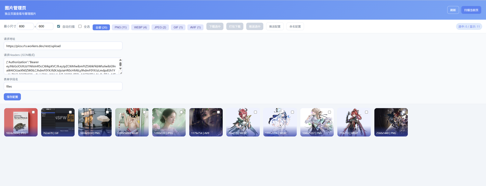
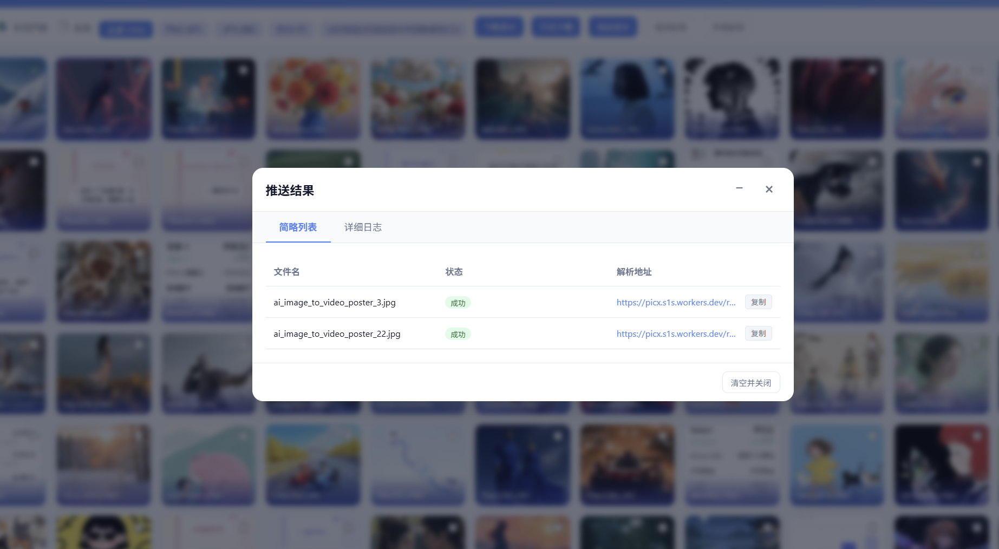

# ROIM-PICX-图片下载器

ROIM-PICX 是一款专为高效图片采集设计的 Chrome 扩展程序。它不仅能进行智能全网页扫描，还提供了强大的过滤、批量管理及远程同步功能，是设计师、运营人员及素材采集者的得力助手。

> 目前正在发布审核中，后期将会开源源码

[Google Chrome Store](https://chromewebstore.google.com/detail/roim-picx-%E5%9B%BE%E7%89%87%E4%B8%8B%E8%BD%BD%E5%99%A8/ndodbonnndjnbgjjgkdfdkdpldadgfea)

## ✨ 核心特性

- **智能多维度扫描**
  - **DOM 扫描**：精准识别标准图片标签。
  - **CSS 深度探测**：自动识别并提取背景图片（Background Images）。
  - **Lazy-Load 支持**：动态滚动探测，支持主流瀑布流及懒加载页面的图片采集。
- **专业级过滤器**
  - **尺寸过滤**：自定义最小宽高，过滤网页装饰性图标与小图。
  - **类型筛选**：支持按扩展名（JPG, PNG, WebP, SVG 等）进行即时过滤。
- **高效批量操作**
  - **框选/全选**：快速选中感兴趣的图片。
  - **智能命名**：支持自定义命名规则，自动处理同名冲突。
  - **一键打包**：支持将选中图片打包为 ZIP 压缩包下载。
- **云端集成（Remote Push）**
  - 支持通过 Webhook 将图片直接推送到远程服务器或图床（如 Cloudflare R2、自建 API 等）。
  - 支持配置自定义 Header 与字段映射。
  - 完善的推送日志系统，实时查看上传进度与结果。

## 🚀 安装指南

1. **下载源码**：克隆或下载本项目压缩包并解压到本地。
2. **打开扩展管理**：在 Chrome 地址栏输入 `chrome://extensions/`。
3. **开启开发者模式**：勾选页面右上角的“开发者模式”开关。
4. **加载程序**：点击“加载已解压的扩展程序”，选择本项目所在的解压目录。

## 📖 使用说明

### 1. 侧边栏模式
点击工具栏的扩展图标，会直接打开侧边栏。
- 在侧边栏中可以进行简单的设置（如最小尺寸限制）。
- 点击“扫描”开始获取当前页面的所有图片。
- 选中的图片可以点击“下载”按钮执行浏览器批量下载。

### 2. 独立管理页
在侧边栏点击“管理页”图标进入全屏管理模式，提供更强大的功能：
- **批量重命名**：按序号、时间戳、原始名进行规则重命名。
- **打包 ZIP**：支持将大量图片一键压缩，避免多次弹出下载确认。
- **远程推送**：在设置面板配置好你的服务器地址，即可实现图片的一键上云。

## 🛠️ 技术细节

- **Manifest V3**：采用最新的扩展开发规范，安全且高性能。
- **JSZip**：本地化图片压缩引擎。
- **Chrome Storage API**：保存用户配置、推送日志与命名偏好。
- **Side Panel API**：提供无感注入的原生侧边栏交互体验。

## 📝 开发与贡献

- `content.js`：负责页面 DOM 与样式的深度扫描。
- `sidepanel.js`：侧边栏交互逻辑。
- `manager.js`：管理页核心逻辑，包含图片处理与推送逻辑。
- `jszip.min.js`：图片打包依赖库。

## 📦 打包与分发 (CRX)

如果你需要将扩展打包成 `.crx` 文件进行分发：

1. 打开 Chrome 扩展管理页：`chrome://extensions/`
2. 点击顶部的 **“打包扩展程序” (Pack extension)** 按钮。
3. 在 **“扩展程序根目录”** 中选择本项目文件夹。
4. 如果是首次打包，无需选择私钥文件。点击确认后，Chrome 会在项目同级目录下生成：
   - `.crx` 文件：可分发的安装包。
   - `.pem` 文件：私钥文件（请妥善保存，后续更新打包时需要用到）。

---

*注意：本扩展仅供学习交流使用，由于图片下载涉及版权问题，请在遵守法律法规及网站版权声明的前提下使用。*
